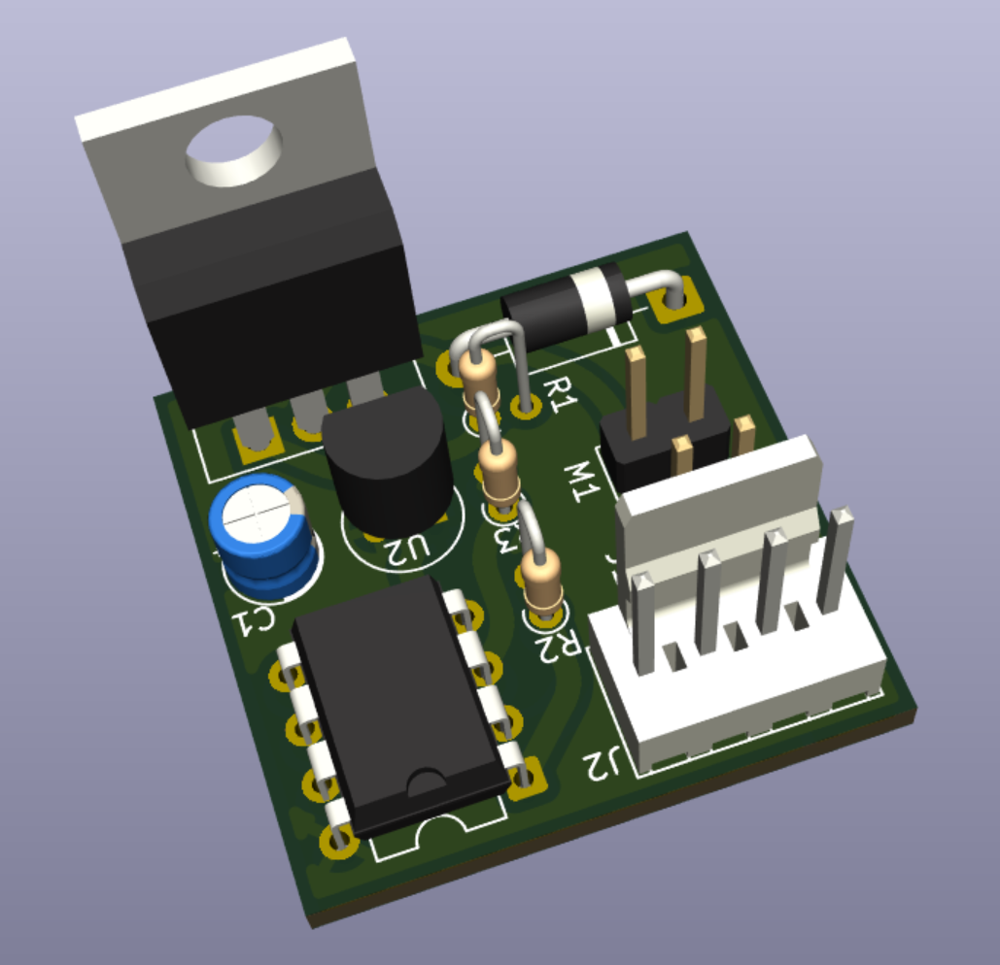

# Tiny85FanControl

[](https://github.com/Colahall/Tiny85FanControl/actions)
[](LICENSE)
[](https://www.microchip.com/en-us/product/attiny85)
[](#project-status)
[](https://github.com/Colahall/Tiny85FanControl)



A temperature-controlled fan system powered by an [ATtiny85](https://www.microchip.com/en-us/product/attiny85) and a [DS18B20](https://www.analog.com/media/en/technical-documentation/data-sheets/ds18b20.pdf) temperature sensor.

> ⚠️ This project is a **work in progress** and may not yet be suitable for all use cases.

## Hardware Requirements

You'll need the following components:

- [ATtiny85](https://www.microchip.com/en-us/product/attiny85) microcontroller
- [USBtinyISP](http://www.fischl.de/usbtinyisp/) (or compatible ISP programmer)
- [DS18B20](https://www.analog.com/media/en/technical-documentation/data-sheets/ds18b20.pdf) 1-Wire temperature sensor
- Passive components (resistors, capacitors, etc.)

Refer to the [Bill of Materials (BOM)](schematic/info/tiny85fancontrol-bom.csv) for part numbers and quantities.

## Software Setup

### Ubuntu 24.04 LTS

```bash
sudo apt-get install build-essential avrdude gcc-avr binutils-avr avr-libc git
````

### Fedora 42

```bash
sudo dnf install avrdude avr-gcc avr-libc git
```

### macOS (via [Homebrew](https://brew.sh/))

```bash
brew tap osx-cross/avr
brew install avr-gcc avrdude git
```

### Windows

Use [WSL](https://docs.microsoft.com/en-us/windows/wsl/install) and follow the **Ubuntu** instructions inside your Linux environment.

## Building and uploading

To build this project, run `make` in the root directory of the project.

```bash
cd /path/to/project/

make        # Builds the binary
make fuse   # Fuses the chip with the configuration
make flash  # Uploads to the ATtiny85 via USBtinyISP
```

## Project Status

This project is working well for my needs, but there are still some things that could be improved.

Feel free to open an issue or submit a pull request if you have any ideas for improvements!

## Contributing

Pull requests and issues are welcome! If you’ve got a feature idea or fix, feel free to:

1. Fork this repo
2. Create a feature branch
3. Push and open a pull request

Please follow the existing code style and structure where possible.

## License

This project is licensed under the [MIT License](LICENSE).
